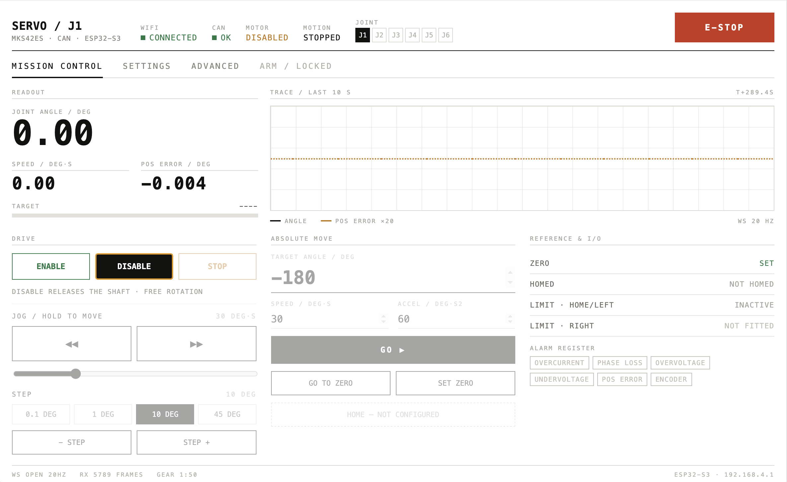
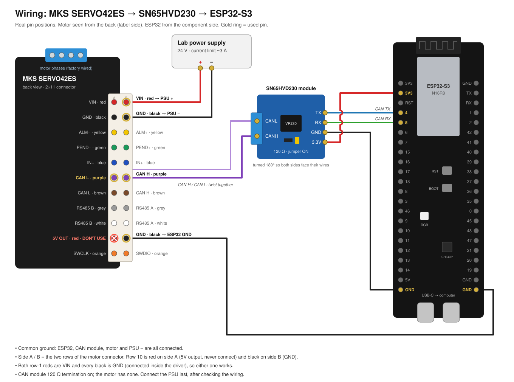

# SERVO42ES ESP32 CAN Controller



Firmware and a browser UI for controlling an MKS SERVO42ES closed-loop stepper over CAN from an ESP32-S3. It's being built as the joint controller for a 6-DOF robotic arm.

## Why

Makerbase ships the SERVO42ES with a PDF manual and no example code for the CAN interface. This project covers the missing part:

- a CAN command reference, checked against the manual's own examples, with the manual's errors listed ([docs/protocol.md](docs/protocol.md))
- ESP32 firmware that talks to the motor over CAN
- a web page served by the ESP32 over WiFi: no app to install and no internet needed

The UI works in joint degrees. You set the gearbox ratio and the firmware converts to motor units.

## Hardware

| Part | Notes |
|---|---|
| MKS SERVO42ES (CAN version) | Closed-loop NEMA17. **Not** the SERVO42E, which uses a different protocol. |
| ESP32-S3 dev board (N16R8) | Has a built-in CAN controller (TWAI) |
| SN65HVD230 CAN transceiver module | 3.3 V, connects directly to the ESP32 |
| 24 V power supply | The driver accepts 20–48 V |

## Wiring



| From | To |
|---|---|
| ESP32 3V3 (left header, 2nd pin) | CAN module 3.3V |
| ESP32 GND (left header, bottom pin) | CAN module GND |
| ESP32 GPIO 4 (left header) | CAN module TX |
| ESP32 GPIO 5 (left header) | CAN module RX |
| CAN module CANH | Motor cable CAN H (purple, side B, row 6) |
| CAN module CANL | Motor cable CAN L (purple, side A, row 6) |
| ESP32 GND (right header, bottom pin) | Motor cable GND (black, side B, row 10; any black works) |
| PSU + (24 V) | Motor cable VIN (red, row 1; either side) |
| PSU − | Motor cable GND (black, row 2) |

The motor's cable has 22 wires, and most colours appear twice, once per connector row. Side A is the row whose 10th wire is red; side B is the row whose 10th wire is black.

- Twist CAN H and CAN L together and keep them short.
- The red wire in row 10 (side A) is the motor's 5V output. Don't connect it.
- Insulate every unused wire end.
- The CAN module's 120 Ω termination is enough for a short bench cable. The motor has no termination of its own.

Full pinout and measurements: [docs/hardware.md](docs/hardware.md).

Power: set the supply's current limit to about 3 A per motor. At 1.5 A, a blocked shaft pulled the 24 V supply down to 8 V and the driver reset itself.

## Features

- Web UI served by the ESP32 at `http://servo-control.local`, with live data over a WebSocket at 20 Hz
- Jog (hold to move), step, go to angle, set zero, smooth stop
- E-STOP (button or Esc key): stops the motor and holds position; motion stays blocked until released
- Live angle, speed and position error with a 10 s trace; motor status, alarms and stall detection
- Messages when the motor restarts, stalls or raises an alarm, so a lost zero doesn't go unnoticed
- Joint units: gear ratio and direction are set in the UI and stored on the ESP32
- Motor settings saved in the motor: run current, stall protection, link-loss timeout
- Maintenance: restart motor, encoder calibration, factory reset, set control mode
- Safety: motion is refused unless the motor is online, enabled and in bus closed-loop mode. Jog stops if the browser goes quiet for 300 ms. Speed is capped at 600 RPM. The motor stops by itself if the ESP32 goes silent.

## Status

Working on the bench with one motor. The CAN link, motion, settings, stall detection, restart and calibration have been tested on hardware. Not done yet: homing and limit switches, and multiple motors on one bus.

## Build and flash

1. Install the Arduino IDE and the **esp32 by Espressif** boards package (tested with 3.3.11). No other libraries are needed.
2. Copy `firmware/servo_controller/secrets.h.example` to `secrets.h` in the same folder, and fill in your WiFi name and password. The ESP32-S3 only supports 2.4 GHz. The file is ignored by git.
3. Open `firmware/servo_controller/servo_controller.ino` and choose these board settings:
   - Board: ESP32S3 Dev Module
   - Flash Size: 16MB
   - PSRAM: OPI PSRAM
   - Partition Scheme: 16M Flash (3MB APP/9.9MB FATFS)
   - USB CDC On Boot: Disabled
4. Upload through the USB-C port labelled COM.
5. Open `http://servo-control.local`. The serial monitor (115200 baud) also prints the IP address.

Pins, motor ID and hostname are in `config.h`. The UI source is `ui/index.html`; after editing it, run `python3 tools/build_ui.py` and rebuild. That regenerates the gzipped copy the firmware serves.

The motor must be in bus closed-loop mode (05) at 500 kbit/s with ID 1. Ours shipped that way. If yours doesn't, the UI shows a banner with a button to switch it.

## Layout

```
firmware/servo_controller/  ESP32 firmware (Arduino sketch) and the web UI (ui/index.html)
firmware/can_test/          minimal read-only CAN test
firmware/move_test/         first motion test
tools/                      build_ui.py: gzips the UI into a header for the firmware
docs/                       protocol reference, hardware notes, decisions, progress log
design/                     original UI design
```

## License

MIT, see [LICENSE](LICENSE). The SERVO42ES manual in `docs/references/` belongs to Makerbase.
